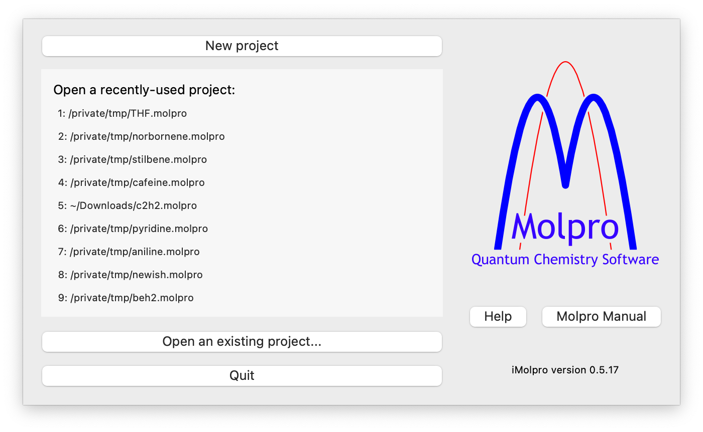
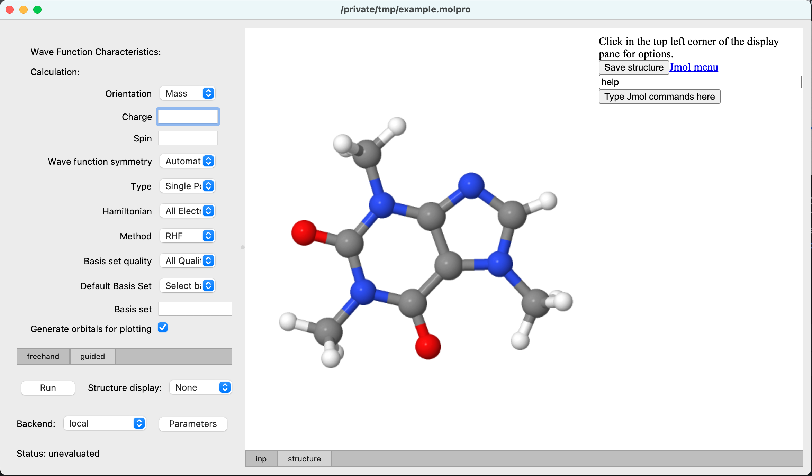
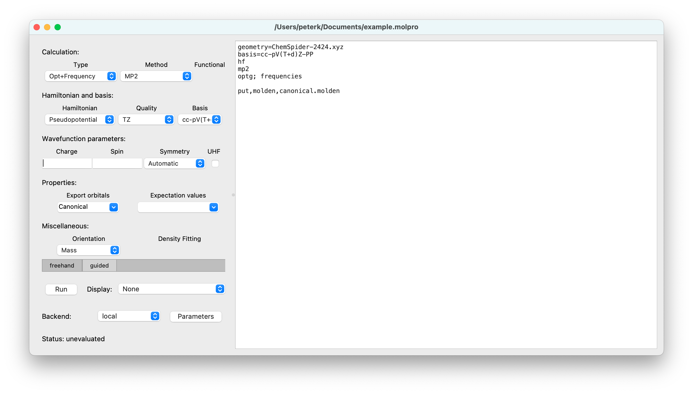

## Example of a complete workflow

On opening the program, in the chooser window  
  
select `New project` and place it in the filesystem using the dialog that is presented. You will then be presented with an opportunity to import a molecular geometry; decline the opportunity, and in response to the next dialog, search for a molecule in PubChem or ChemSpider (for the latter, you need first to get an API key from https://developer.rsc.org/get-started). We are then presented with the main project window:  
  
The left part of the project window is all about specifying the input for a Molpro job, and the right part displays usually aspects of a completed calculation, but, as here, can also be filled with the initial structure. The structure displayed at this point is editable using the embedded Jmol builder, for which options can be found be clicking near the top left corner.

We now proceed to specify an MP2 geometry optimisation and frequency calculation using the 'guided mode' controls in the left region. The raw molpro input that is generated  can be seen and edited by selecting the `freehand` tab. On toggling back to `guided`, the right hand pane gives a read-only view of the input, which now looks like this:  
  
You are free to change the input either using the `guided` pane, or by directly editing the molpro input in the `freehand` pane; if you do the latter, guided mode can still be used later provided that the molpro input is sufficiently simple that it can be parsed.

In order to run the job, simply press the `Run` button, which will launch the job on the local machine. The output will be displayed in the right pane, and the job status is shown at the bottom left.
When it is finished, you can view orbitals and vibrational modes by selecting `example.molden` in `Structure display`:  
  
You can then select particular vibrational modes to animate, or orbitals to see contour graphics. Finer control can be achieved through the Jmol menu, or by typing any Jmol command.

If you want to run jobs on a different computer, you need first to define an appropriate `backend` as described [here](backends.md). Backends can be set up with adjustable parameters, for example to specify the number of parallel processes, and these can be set for the project via the `Parameters` button.

If you want to export the optimised geometry, you can access it, or any file in the project bundle, through `Files/Export file` in the menu bar.

